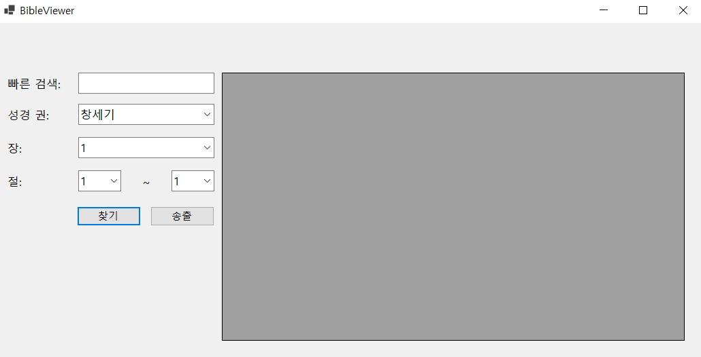
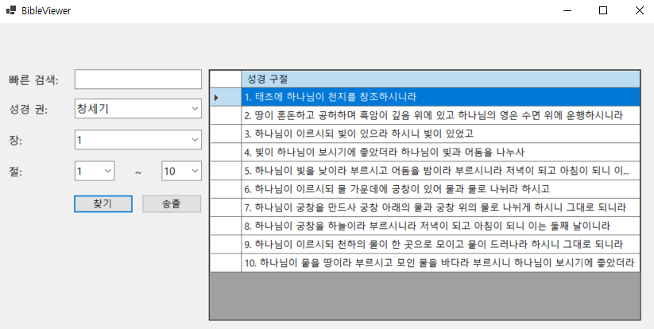
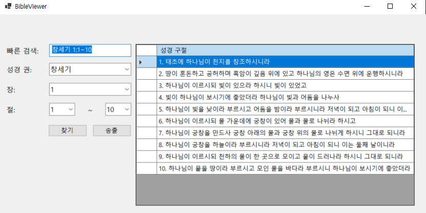
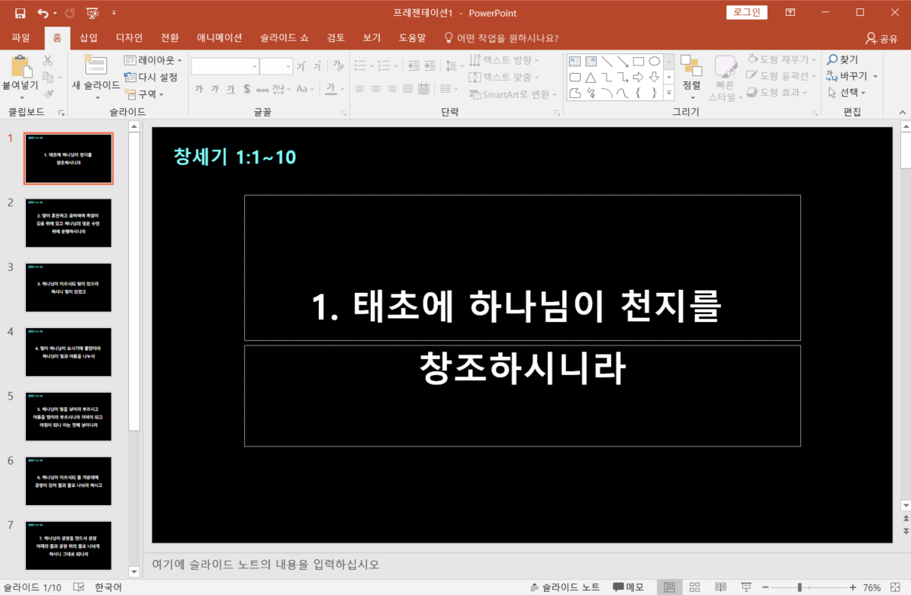

# BibleViewer (C# Windows Forms)

설교 중 성경 구절을 실시간으로 띄우기 위해 만든 GUI 프로그램입니다.  
사용자가 원하는 성경 구절을 검색하면 PPT로 자동 출력됩니다.

## 🔧 사용 기술
- C#, Windows Forms
- SQLite
- PowerPoint COM 제어 (Office 2016)

## 📌 주요 기능
- 구절 검색 및 자동 PPT 출력
- 단어 단위 줄바꿈 지원
- 빠른 검색 UI 제공

## 🖥️ 실행 방법
1. 이 저장소를 클론하거나 ZIP으로 다운로드합니다.
2. Visual Studio에서 bibleViewer.sln 파일을 열어주세요.
3. F5 키를 눌러 실행합니다.
4. 실행된 프로그램에서 성경 구절을 검색하면, PowerPoint가 자동으로 열리며 구절이 표시됩니다.

## 🖼️ 스크린샷
## 실행화면

## 일반검색화면

## 빠른검색화면

## 송출버튼 눌렀을 시 화면

